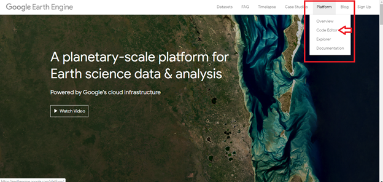
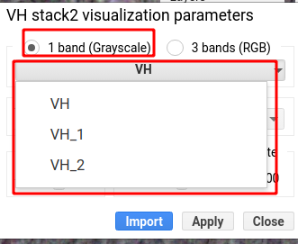

# Introducción a Google Earth Engine


<h1>Imágenes Radar de Apertura Sintética (SAR) en Google Earth Engine aplicado a la agricultura</h1> 
<h2>Manual introductorio de Google Earth Engine - Monitoreo de cultivos 1 </h2> 

<p>Este manual fue elaborado por la Escuela de Geografía de la Universidad de Costa Rica, para el cual colaboraron Emmanuel Jesús Céspedes-Rivera y Cristian Aguilar-Barboza en calidad de asistentes avanzados del proyecto "Transformación digital: Incorporación de tecnología SAR en la gestión de riesgos, agricultura y recursos naturales para Centroamérica", en el marco del proyecto UCREA-IICA.</p>
<p>Este proyecto está coordinado por el Dr Edgar Espinoza Cisneros y co-cordinado por MSc María José Molina Montero. Para mayor información contactar a maria.molinamontero@ucr.ac.cr .</p>

<p>Índice</p> 

<p><li><a href="#Sección1">1. Prerrequisitos</a></li>
<li><a href="#Sección2">2. Introducción</a></li>
<li><a href="#Sección3">3. Interfaz de Google Earth Engine</a></li>
<li><a href="#Sección4">4. Procesamiento y análisis</a></li>
<li><a href="#Sección5">5. Conclusiones y recomendaciones</a></li>
<li><a href="#Sección6">6. Bibliografía</a></li></p> 

<p><h2 id="Sección1">1. Prerrequisitos</h2></p>


<p>Para ejecutar esta rutina el usuario previamente debe crear una cuenta en la plataforma Google Earth Engine (GEE), ingresando en <p><a href="https://earthengine.google.com/" target="_blank">https://earthengine.google.com/</a></p> GEE, es una plataforma para la visualización y análisis de datos geoespaciales en la nube, por lo tanto, no existe la necesidad de invertir equipos y programas especializados (Google Earth Engine, 2019). GEE tiene disponible repositorios de información entre los cuales se encuentran: series temporales de Landsat, Sentinel, MODIS, SRTM, entre otros.</p> 

<p>Esta plataforma utiliza en su editor de código el lenguaje de programación JAVA, aunque también posee una API Python vinculada al Google Drive.</p> 

<p>Como guía para crear una cuenta en GEE ingrese a:</p> 


<p><a href="https://www.youtube.com/watch?v=E60J32Umqeo" target="_blank">https://www.youtube.com/watch?v=E60J32Umqeo</a></p>


<p><h2 id="Sección2">2. Introducción</h2></p>

<p>El monitoreo de cultivos es una de las principales herramientas en agricultura, la estimación del área de cobertura, productividad, incidencia de enfermedades, evolución o cambios en la estructura de los cultivos...etc; estas actividades resultan fundamentales en términos de estudiar y mejorar la actividad agrícola (Mutanga & Kumar, 2019).</p>

<p>GEE es una plataforma en la nube que posee acceso de diferentes repositorios de información, caso de Landsat, MODIS, Sentinel, SoilGrids, SRTM, ALOS-Palsar, HydroSheds entre muchos otros que favorecen el monitoreo agrícola de forma gratuita y sin cargas computacionales elevadas.</p>

<p>La detección remota con sensores ópticos requieren de observaciones con productos de buena calidad, libre de nubes o sombras de nubes para minimizar la confusión espectral de los datos (Shen et al., 2019), sin embargo, en zonas tropicales las coberturas nubosas son constantes y abundantes, su aplicación resulta limitada (Flores et al., 2019). Debido a este aspecto, se ha implementado el uso de la imágenes SAR, la cual despeja la limitante de la nubosidad y permite la obtención continua de información (Flores et al., 2019).</p>

<p>En tanto los datos SAR son efectivos en este tipo de estudios, sin embargo, la descarga y pre-procesamiento de los datos en “crudo” directamente en el ordenador requiere de alta capacidad de procesamiento, elemento que puede ser omitido con el uso de GEE. El cual, provee información pre-procesada y lista para el análisis y monitoreo agrícola.</p> 

<p>En este manual se muestra una metodología simple para el monitoreo de cultivos de caña, a partir de la interpretación y análisis espacio-temporal de los valores de retrodispersión.</p>

<p><h3>2.1. Objetivos de aprendizaje:</h3></p>

<p><li>Introducir al manejo de la interfaz de editor de código de GEE.</li>
<li>Analizar los procesos de interacción de la señal SAR con la superficie terrestre.</li>
<li>Observar y monitorear los cambios temporales en cultivos de caña.</li>
<li>Identificar ventajas y desventajas del uso de imágenes SAR en el monitoreo agrícola con GEE.</li></p>

<p><h2 id="Sección3">3. Interfaz de Google Earth Engine</h2></p>
 

<p>Para abrir el editor de código ingrese en: <a href="https://earthengine.google.com/" target="_blank">https://earthengine.google.com/</a>, y ubiquese en la opción  (Fig 1), luego seleccione Code Editor.</p> 
  

<h4 id="Sección3">Fig 1. Acceso al code editor desde la página web de Google Earth Engine.</h4>

<p>Una vez hecho esto se le desplegará el editor de código de GEE, el cual se detalla en la Fig 2.</p> 
  

<h4 id="Sección3">Fig 2. Interfaz de editor de código GEE.</h4>

<p>Es importante señalar que en la plataforma en “repositorio de código” en la sección de <strong>“Examples”</strong> puede encontrar una serie de códigos de ejemplo con diferentes tipos de datos de origen con los cuales puede experimentar y editar a conveniencia para diferentes aplicaciones.<p>
  
<p><h2 id="Sección4">4. Procesamiento y análisis</h2></p>

<p> <Strong><h3>Nota:</h3></Strong> El código ejecutado en el presente manual se puede acceder por medio del siguiente link: <a href="https://code.earthengine.google.com/51fa8a89e12bdc92b25e2822d5a82d1d" target="_blank">https://code.earthengine.google.com/51fa8a89e12bdc92b25e2822d5a82d1d</a><p>


<p>Primero selecciona un área de interés, para esto puede utilizar el administrador de geometrías, y puede seleccionar la opción de polígonos o puntos. En este caso, dibuje un rectángulo sobre el área a analizar. Una vez que lo dibuje, vaya a la casilla <strong>Geometry imports</strong> (Fig 3) y asígnele un nombre (roi).</p>


<h4 id="Sección4">Fig 3. Seleccionar área de interés con administrador de geometrías.</h4>

<p>Proceda a llamar la colección de imágenes de GRD de Sentinel-1, tanto para las polarizaciones  VV, como VH. Utilice el siguiente fragmento de código para la polarización VV. Copie lo siguiente y pegue en el editor de código: </p> 


```javascript
// Get the VV collection.
var collectionVV = ee.ImageCollection('COPERNICUS/S1_GRD')
    .filter(ee.Filter.eq('instrumentMode', 'IW'))
    .filter(ee.Filter.listContains('transmitterReceiverPolarisation', 'VV'))
    .filter(ee.Filter.eq('orbitProperties_pass', 'DESCENDING'))
    .filterBounds(roi)
    .select(['VV']);
```

<p>Puede notar cómo se filtra la polarización (VV), así como el modo de adquisición y la órbita (Descendente), además, se delimita la zona de interés (roi). Lo anterior, puede editarse para utilizar la órbita descendente, así como la polarización VH. Ahora llame a la colección de imágenes en polarización VH. Copie lo siguiente y pegue en el editor de código:</p>

```javascript
// Get the VH collection.
var collectionVH = ee.ImageCollection('COPERNICUS/S1_GRD')
    .filter(ee.Filter.eq('instrumentMode', 'IW'))
    .filter(ee.Filter.listContains('transmitterReceiverPolarisation', 'VH'))
    .filter(ee.Filter.eq('orbitProperties_pass', 'DESCENDING'))
    .select(['VH'])
    .filterBounds(roi);
```
<p>Una vez hecho, realizaremos un filtro para las fechas de interés, esto se realizará para cada colección de imágenes (VV y VH). Utilice el siguiente fragmento de código:</p>

```javascript
//Filter by date
var VV_image = collectionVV.filterDate('2020-01-15', '2020-06-30');
var VH_image = collectionVH.filterDate('2020-01-15', '2020-06-30');
print(VV_image, 'VV_image');
print(VH_image, 'VH_image');
```
<p>El comando print permite reflejar los resultados en la consola de GEE (Fig 4), en este caso la cantidad de imágenes disponibles para el área de interés en el periodo asignado.</p> 


<h4 id="Sección4">Fig 4.Imágenes disponibles en las colecciones VV y VH en la consola.</h4>

<p>Seguidamente se procede a crear un apilado de imágenes mensuales, utilizando el valor medio de todas las imágenes (<strong>“.mean ()”</strong>) para cada mes.</p>

<p>Copie lo siguiente y pegue en el editor de código:</p> 

```javascript
// Create a 3 band stack by selecting from different periods (months)
var im1 = ee.Image(collectionVV.filterDate('2020-01-15', '2020-02-28').mean());
var im2 = ee.Image(collectionVV.filterDate('2020-03-01', '2020-03-30').mean());
var im3 = ee.Image(collectionVV.filterDate('2020-06-01', '2020-06-30').mean());
```
<p>Proceder a realizar el mismo paso anterior para el caso de la polarización VH.</p>

<p>Copie lo siguiente y pegue en el editor de código:</p> 

```javascript
// Create a 3 band stack by selecting from different periods (months)
var im1_1 = ee.Image(collectionVH.filterDate('2020-01-15', '2020-02-28').mean());
var im2_1 = ee.Image(collectionVH.filterDate('2020-03-01', '2020-03-30').mean());
var im3_1 = ee.Image(collectionVH.filterDate('2020-06-01', '2020-06-30').mean());
```
<p>Seguidamente se procede a desplegar una imagen RGB con base a los apilados de imágenes anteriormente creados. Este paso le permite observar los cambios en los valores de retrodispersión para cada uno de los meses, pasando por el canal Rojo la imagen im1, por el Verde la imagen im2 y Azul la imagen im3, en este caso para la polarización VV. El comando de escritura es Map.addLayer el cual nos permite añadir al visualizador la capa de interés, entre corchetes (“{}”) se asignan los valores min y max o se deja en blanco para que se añada con los valores por defecto y finalmente luego de una, en comillas simples el nombre con el que aparecerá la capa en el administrador de capas.</p> 

```javascript
Map.addLayer(im1.addBands(im2).addBands(im3), {min: -25, max: 0}, 'VV stack1');
```

<p>Se ejecuta lo mismo para la polarización VH.</p>

```javascript
Map.addLayer(im1_1.addBands(im2_1).addBands(im3_1), {min: -25, max: 0}, 'VH stack2');
```
<p>Una vez hecho esto en la pestaña Layers, se desplegará el apilado de imágenes en una imagen RGB tanto para VV como VH.</p>


<h4 id="Sección4">Fig 5. Visualización de los apilados RGB.</h4>

<p>Cada uno de estos apilados está conformado por tres imágenes (im1, im2 e im3), cada una se puede visualizar de forma individual. Para hacer esto, dirijase a la pestaña Layers y elija alguno de los “Stack” disponibles, con la opción ( ), una vez ahí se habilitará lo siguiente:</p>


<h4 id="Sección4">Fig 6. Parámetros de visualización en pestaña Layers (3 bands (RGB)).</h4>

<p>Cambie el parámetro 3 bands (RGB) a 1 band (Grayscale), una vez acá puede elegir cada una de las imágenes del apilado.</p>


<h4 id="Sección4">Fig 7. Parámetros de visualización en pestaña Layers (1 band (Grayscale)).</h4>


<p>Analice cada una de las imágenes en relación a su retrodispersión. Para esto puede utilizar la pestaña Inspector.</p>


<h4 id="Sección4">Fig 8. Inspector de GEE.</h4>

<p>Para usarlo simplemente debe dirigirse a algún sitio de la imagen desplegada y presionar click izquierdo, inmediatamente se desplegará una serie de información relacionada con los niveles de retrodispersión en las distintas imágenes (Fig 9).</p>


<h4 id="Sección4">Fig 9. Niveles de retrodispersión para un sitio, herramienta Inspector.</h4>

<p>También se puede visualizar el comportamiento temporal de los niveles de retrodispersión del área de estudio (roi). Utilice el siguiente fragmento de código.</p>

```javascript
// Get the VV and VH collection for chart plot.
var collectionVH_VV = ee.ImageCollection('COPERNICUS/S1_GRD')
    .filter(ee.Filter.eq('instrumentMode', 'IW'))
    .filter(ee.Filter.listContains('transmitterReceiverPolarisation', 'VV'))
    .filter(ee.Filter.listContains('transmitterReceiverPolarisation', 'VH'))
    .filter(ee.Filter.eq('orbitProperties_pass', 'DESCENDING'))
    .select(['VV','VH'])
    .filterBounds(roi)
```
<p>Para crear el gráfico debe ejecutar la siguiente línea de código, donde se añade la colección de imágenes, y se detallan los elementos que va a poseer el gráfico.</p>

```javascript
// Create an image time series chart for ROI of change in the all time collection
// Plot a time series at a ROI
var chart1 = ui.Chart.image.series(collectionVH_VV, roi)
    .setChartType('ScatterChart')
    .setOptions({
      title: 'Sentinel 1 time series at ROI',
      trendlines: {0: {
        color: 'CC0000'
      }},
      lineWidth: 1,
      pointSize: 3,
    });
```
<p>Una vez ejecutado este código, debemos utilizar la función <strong> print ()</strong> para visualizar el gráfico en la consola.</p>

```javascript
print(chart1)
```


<h4 id="Sección4">Fig 10. Gráfico de retrodispersión en la consola de GEE para el área de estudio.</h4>

<p>Para analizar una parcela o un valor de píxel en específico, se debe primero digitalizar el punto o la parcela del área de interés y seguidamente ejecutar el siguiente código para preparar los datos del gráfico. Utilice el administrador de geometrías, para esto puede seleccionar la opción de polígonos o puntos. En este caso, dibuje un punto sobre el área a analizar. Una vez que lo dibuje, vaya a la casilla <strong>Geometry imports</strong> y asígnele un nombre (point).</p>

```javascript
// Create an image time series chart for one point of change in the all time collection
// Plot a time series at a point.

var chart = ui.Chart.image.series({
  imageCollection: collectionVV,
  region: point,
  reducer: ee.Reducer.mean(),
  scale: 200
});
```
<p>Una vez preparados los datos de entrada, se detallan los elementos del gráfico, la ubicación y dimensiones. En este caso visualizamos el gráfico en el visualizador de capas <strong>(Layers)</strong>.</p>

```javascript
// Add the chart to the map. 
chart.style().set({
  position: 'bottom-right',
  width: '500px',
  height: '300px'
});
```

<p>Para visualizar el gráfico ejecute <strong>Map.add(chart)</strong>:</p>

```javascript
Map.add(chart);
```


<h4 id="Sección4">Fig 11. Gráfico de retrodispersión en la consola de GEE para un punto.</h4>

<p>Ahora, analice el comportamiento temporal de los niveles de retrodispersión.</p>


<p><h2 id="Sección5">5. Conclusiones y recomendaciones.</h2></p>

<p>La gran cantidad de repositorios de información que ofrece GEE, permite el análisis de múltiples fenómenos, sin recurrir a la descarga de información ni cargas computacionales de hardware y software elevadas.</p  

<p>La disponibilidad de imágenes SAR pre-procesadas reduce los tiempos de ejecución. Además de favorecer la ejecución de grandes conjuntos de datos en un mismo proceso (Big data).</p  
  
<p>En relación a los diferentes procesos disponibles, la plataforma de GEE posee la capacidad de ejecución de una gran variedad de procesos que permiten el monitoreo no únicamente agrícola sino de diferentes elementos como el bosque, ciudades, cuerpos de agua, inundaciones entre muchos otros que hacen de ella una herramienta muy potente.</p 

<p>Por otro lado, el editor de código ofrece gran versatilidad al ejecutar procesos, no obstante, requiere conocimientos básicos en programación.</p

<p><h2 id="Sección6">6. Bibliografía.</h2></p>

<p>Flores, A. I., Herndon, K. E., Bahadur Thapa, R., & Cherrington, E. (Eds.). (2019). The Synthetic Aperture Radar (SAR) Handbook: Comprehensive Methodologies for Forest Monitoring and Biomass Estimation. <a href="https://doi.org/10.25966/nr2c-s697" target="_blank">https://doi.org/10.25966/nr2c-s697</a></p>

<p>Mutanga, O., & Kumar, L. (2019). Google Earth Engine Applications. Remote Sensing, 11(5), 591. <a href="https://doi.org/10.3390/rs11050591" target="_blank">https://doi.org/10.3390/rs11050591</a></p></p>

<p>Shen, W., Li, M., Huang, C., Tao, X., Li, S., & Wei, A. (2019). Mapping annual forest change due to afforestation in Guangdong Province of China using active and passive remote sensing data. Remote Sensing, 11(5), 1-21. <a href="https://doi.org/10.3390/rs11050490" target="_blank">https://doi.org/10.3390/rs11050490</a></p>
